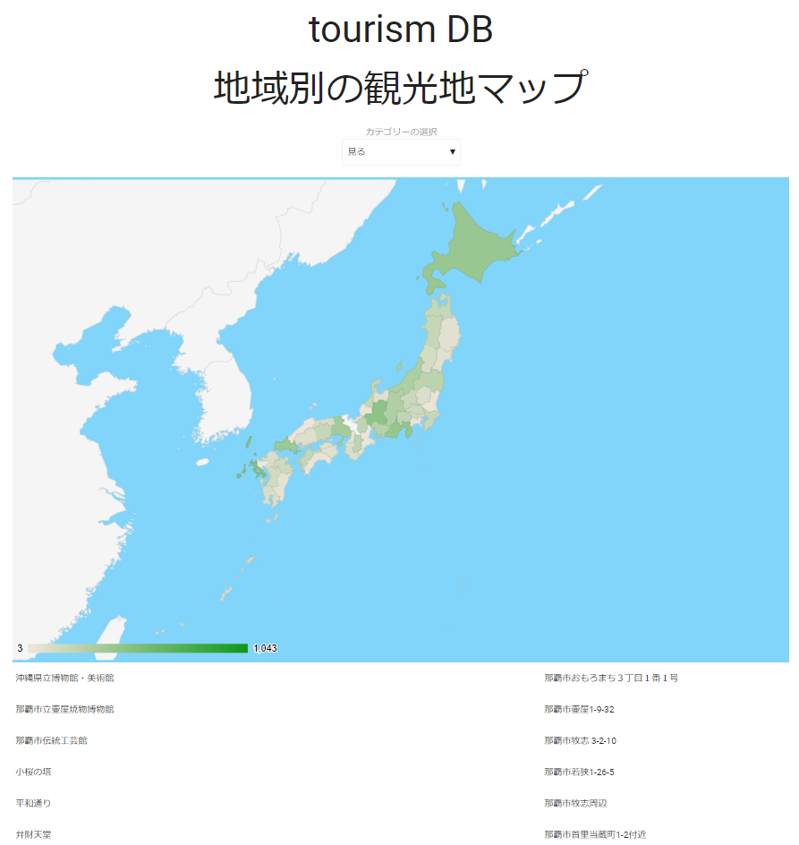

# tourismMap
日本地図に観光地情報をマッピングするシステム

## 言語
- JavaScript
- PHP
- mySQL

## 使用したライブラリ
- [MaterializeCSS](http://materializecss.com/)
- [Google Charts : Visualization: GeoChart](https://developers.google.com/chart/interactive/docs/gallery/geochart)

## デモ
[tourismMap](http://matayoshi.nkmr.io/work/webcontents/tourism/)

## tourism_db.csvについて
SQLなどにインポートすることができます。カラムは`id`,`name`,`yomi`,`category`,`prefecture`,`city`,`address`と設定しています。utf-8でファイルを出力しているため、Excelで開くと文字化けします。shift-JISで保存し直すと開けます。

## 使用したデータ
[公共クラウドシステム:観光情報ダウンロードサイト](https://www.chiikinogennki.soumu.go.jp/k-cloud-api/search/download/)
この作品は、以下の著作物を改変して利用しています。
公共クラウド（総務省）、【データ属性情報】、CCライセンス 表示 2.1 日本[http://creativecommons.org/licenses/by/2.1/jp/](http://creativecommons.org/licenses/by/2.1/jp/)、公共クラウド利用規約[https://www.chiikinogennki.soumu.go.jp/k-cloud-api/code/](https://www.chiikinogennki.soumu.go.jp/k-cloud-api/code/)
